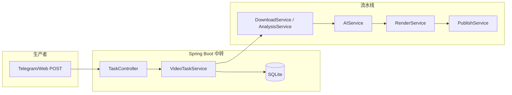

# Pulse-Content-Factory (PCF) 技术规格书

**版本**：0.1.0  
**栈**：Spring Boot 3.x · SQLite · FFmpeg · yt-dlp · Playwright (Java) · DeepSeek (OpenAI 协议) · SiliconFlow (TTS)

---

## 1. 目标与边界

### 1.1 目标

构建一条 **生产者—中转站—消费者** 链路：手机端投递分享链接 → Spring Boot 入队与编排 → Windows Worker（本仓库可作为同机部署的服务端 + 可选远程 Worker）完成下载、AI 文案、TTS、合成与（可选）自动发布。

### 1.2 边界与合规声明

- 解析、下载与再发布须遵守各平台服务条款与版权法律；本工程仅提供 **技术骨架与可配置集成点**，不包含对特定站点的破解或绕过保证。
- 抖音/小红书 DOM 与上传流程变更频繁，**发布相关选择器、URL 必须可配置**，并预留人工介入（仅打开持久化浏览器由用户登录）。

---

## 2. 总体架构



- **入站**：HTTP `POST /api/tasks`（可扩展 Telegram 长轮询/Webhook）。
- **状态机**：`content_tasks.status` 整型枚举驱动；失败写入 `-1` 并记录 `retry_count`。
- **出站**：本地文件 `local_path`；发布模块读取该路径与 AI 标题。

---

## 3. 数据模型

### 3.1 表 `content_tasks`

| 字段 | 类型 | 说明 |
|------|------|------|
| id | INTEGER PK AI | 主键 |
| platform | TEXT | `douyin` / `xiaohongshu` 等 |
| share_url | TEXT UNIQUE | 分享链接，防重复 |
| video_id | TEXT | 解析后平台视频 ID（若可得） |
| title_original | TEXT | 原标题/文案 |
| title_generated | TEXT | AI 仿写标题 |
| status | INTEGER | 见 §3.2 |
| local_path | TEXT | 成片绝对路径 |
| retry_count | INTEGER | 默认 0 |
| error_message | TEXT | 失败原因（实现中建议扩展） |
| created_at / updated_at | DATETIME | 审计字段（建议） |

### 3.2 状态码 `status`

| 值 | 含义 |
|----|------|
| 0 | 待解析 |
| 1 | 下载中 |
| 2 | 文案生成中 |
| 3 | 渲染中 |
| 4 | 发布中 |
| 5 | 已完成 |
| -1 | 失败 |

### 3.3 防重

- 对 `share_url` 建 **唯一索引**；插入冲突时返回已有任务 ID 或 409，由业务策略决定（本工程：捕获异常并提示）。

---

## 4. 模块设计

### 4.1 输入捕获（Ingest）

- **HTTP**：`POST /api/tasks`，Body：`{ "text": "含链接的原始文本", "platform": "douyin" }`。
- **LinkParserUtil**：从杂乱分享语中提取 `http(s)://...` 及常见短链；可扩展平台专属正则。
- **Telegram（可选）**：独立 `TelegramIngestService` 轮询 `getUpdates` 或 Webhook 转调同一入队逻辑（本期骨架以 HTTP 为主）。

### 4.2 素材解析（Analysis / Download）

- **下载**：调用系统 **`yt-dlp`**（需 PATH 可执行），输出至 `${pcf.work-dir}/temp/raw/{taskId}/video.mp4`。
- **音频**：`ffmpeg -i video.mp4 -vn -acodec libmp3lame original_bgm.mp3`
- **关键帧**：`ffmpeg -ss` 在 0%/50%/100% 附近截帧 PNG，供后续视觉分析扩展（本期可仅落盘）。

### 4.3 AI（DeepSeek / OpenAI 协议）

- **Analyzer_Prompt**：输出 JSON（钩子、痛点、结构）。
- **Generator_Prompt**：基于「原视频 DNA」与人设生成约 50 字文案/标题。
- **实现**：`AIService` 使用 OkHttp 调用 `base-url` + `/chat/completions`，`Authorization: Bearer ${api-key}`。

### 4.4 渲染（Render）

- **TTS**：SiliconFlow HTTP API 生成语音 WAV/MP3（具体端点以官方文档为准，配置在 `application.yml`）。
- **素材**：优先 `${pcf.local-footage-dir}`（如 `C:/MyFootage/`），不足时 **Pexels API** 拉取（API Key 可配置）。
- **FFmpeg**：`FFmpegCommandBuilder` 拼接滤镜链；**去重**可加入轻微 `crop` / `eq` 随机参数（种子可由 taskId 派生以保证可复现与差异并存）。

### 4.5 发布（Playwright）

- **BrowserInitializer**：`launchPersistentContext(userDataDir)`，减少重复扫码。
- **DouyinPublishFlow**：选择器来自配置；步骤：打开创作者中心 → 上传 → 等待进度节点 → 填入标题与话题。
- **安全延时**：每步 `Thread.sleep` 或 Playwright 等待 2–5 秒随机（`pcf.publish.min-delay-ms` / `max-delay-ms`）。
- **Cookie**：持久化目录即等价于「登录态」；亦可扩展导出 Cookie 文件注入（非本期必须）。

---

## 5. 核心编排：`VideoTaskService`

推荐异步执行（`@Async` 或 `TaskExecutor`），避免阻塞 HTTP：

1. `PENDING(0)` → 校验 URL → `DOWNLOADING(1)`  
2. yt-dlp 下载 + FFmpeg 抽音频/截帧  
3. `GENERATING_COPY(2)`：AIService 分析 + 生成标题  
4. `RENDERING(3)`：TTS + 素材 + FFmpeg 出 `final_video.mp4`，写 `local_path`  
5. `PUBLISHING(4)`：可选；Playwright 上传  
6. `DONE(5)` 或 `FAIL(-1)`  

失败时递增 `retry_count`，`error_message` 记录堆栈摘要。

---

## 6. 配置项约定（`application.yml`）

| 键 | 说明 |
|----|------|
| `pcf.work-dir` | 工作根目录（temp、输出） |
| `pcf.yt-dlp-path` / `pcf.ffmpeg-path` | 可执行文件路径；空则假定 PATH |
| `pcf.local-footage-dir` | 本地素材库 |
| `pcf.deepseek.*` | base-url、api-key、model |
| `pcf.siliconflow.*` | TTS base-url、api-key、model/voice |
| `pcf.pexels.api-key` | 可选 |
| `pcf.playwright.user-data-dir` | 浏览器配置目录 |
| `pcf.publish.*` | 创作者中心 URL、上传按钮等选择器占位 |

---

## 7. API 与后台

- **REST**：创建任务、查询任务、触发重试（可后续加）。
- **Web**：Thymeleaf 简单列表页：状态、`share_url`、`local_path`、错误信息；若文件存在可提供静态访问或 `file://` 链接触发下载（实现时注意安全性，建议仅内网）。

---

## 8. 部署与依赖

- **JDK**：17+  
- **操作系统**：开发可 macOS/Linux；生产 Worker 多为 Windows（路径在配置中区分）。  
- **外部二进制**：`ffmpeg`、`yt-dlp` 必须可用；Playwright 首次需 `mvn exec:java` 安装浏览器或由官方 CLI 安装。  
- **网络**：DeepSeek、SiliconFlow、Pexels 及平台站点需可达。

---

## 9. 测试与验收

- 单元测试：`LinkParserUtil`、状态流转、FFmpeg 命令拼装（不真正执行或 mock `ProcessBuilder`）。  
- 集成测试：嵌入式 SQLite + MockWebServer 模拟 LLM/TTS。  
- 手工验收：提交真实分享链接 → 数据库状态直至 `5` → 本地存在成片；发布步骤在测试账号上人工确认。

---

## 10. 演进路线

1. Telegram Webhook / 长轮询与任务表合一。  
2. 将下载从 yt-dlp 切换为商业解析 API（TikHub 等）的可插拔 `MediaResolver` 接口。  
3. MoneyPrinterTurbo API 模式对接，替换自研 FFmpeg 拼装。  
4. 队列解耦：Redis/RabbitMQ，`Worker` 独立进程拉取。  
5. 审计与多租户：按用户/频道隔离 `content_tasks`。

---

## 11. 仓库结构（实现约定）

```
src/main/java/com/pcf/
├── config/
├── controller/
├── dao/
├── model/
├── service/
└── util/
```

详见代码与 `README`（若已生成）。
